# Highly Available and Scalable Web Server Infrastructure

This repository provides a detailed guide to setting up a robust and scalable web server infrastructure on AWS. The setup ensures high availability, secure data handling, and scalability to meet varying traffic demands.

---

## Table of Contents
1. [Introduction](#introduction)
2. [Infrastructure Phases](#infrastructure-phases)
   - [Phase 1: Initial EC2 Setup](#phase-1-initial-ec2-setup)
   - [Phase 2: Core Infrastructure Development](#phase-2-core-infrastructure-development)
   - [Phase 3: Database Configuration and Security](#phase-3-database-configuration-and-security)
   - [Phase 4: Database Migration](#phase-4-database-migration)
3. [Cost Overview](#cost-overview)
4. [Validation and Testing](#validation-and-testing)
5. [Architecture Diagram](#architecture-diagram)
6. [Support](#support)

---

## Introduction

This project demonstrates how to design a scalable and highly available web server infrastructure using AWS services like EC2, VPC, RDS, Auto Scaling Groups, and Application Load Balancers. Each phase is tailored to enhance specific aspects of the infrastructure, including scalability, performance, and security.

---

## Infrastructure Phases

### Phase 1: Initial EC2 Setup
- **Goal**: Launch an EC2 instance to host both the web application and database as the foundational layer.
- **Steps**:
  1. Create an EC2 instance through AWS Management Console or CLI.
  2. Deploy the web application and database on this instance.
- **Key Tools**: AWS EC2, AWS CLI.
 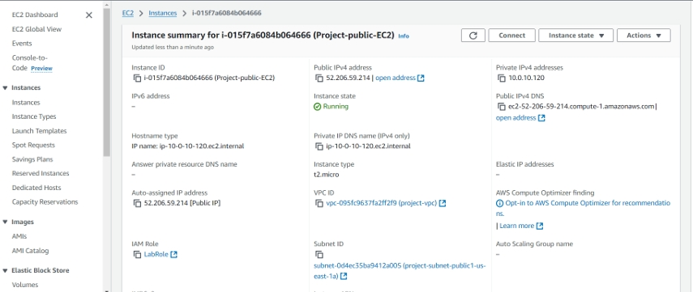

---

### Phase 2: Core Infrastructure Development
#### Step 2.1: Virtual Private Cloud (VPC) and Subnets
- **Objective**: Implement a VPC with isolated resources in public and private subnets.
- **Actions**:
  1. Create a VPC with two public and two private subnets.
- **Tools Used**: AWS VPC, AWS CLI.
 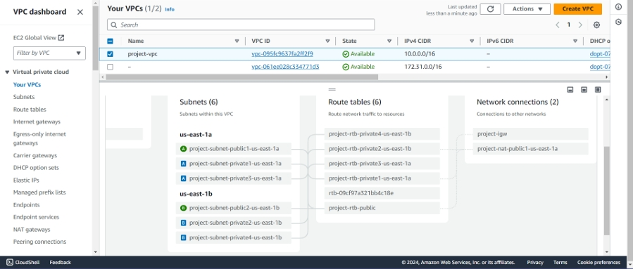

#### Step 2.2: Auto Scaling Setup
- **Objective**: Enable automatic scaling of web servers based on traffic.
- **Actions**:
  1. Configure an Auto Scaling Group with desired capacity: 2, min: 2, max: 4.
  2. Deploy EC2 instances across public subnets.
- **Key Tools**: AWS Auto Scaling Groups, AWS Management Console.
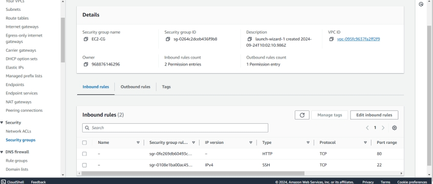
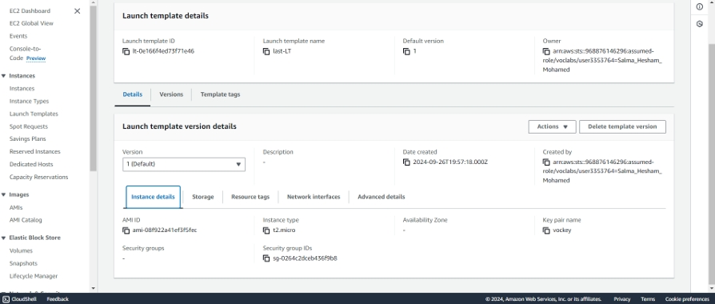
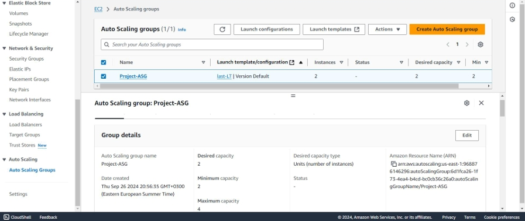
#### Step 2.3: Load Balancer Configuration
- **Objective**: Distribute incoming requests evenly across EC2 instances.
- **Actions**:
  1. Set up an Application Load Balancer (ALB) in public subnets.
  2. Configure security groups to allow HTTP/HTTPS traffic.
- **Tools Used**: AWS ALB, AWS CLI.
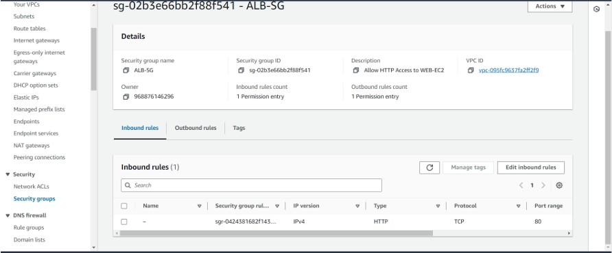
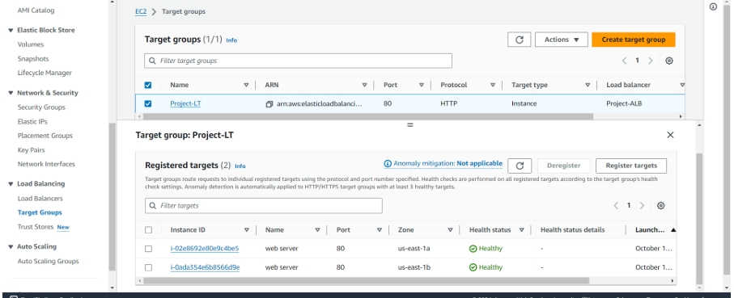
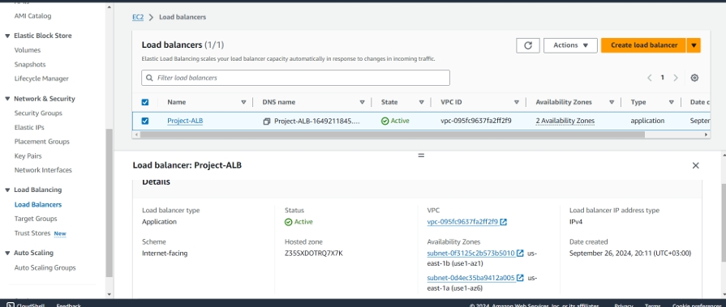

---

### Phase 3: Database Configuration and Security
#### Step 3.1: MySQL RDS Deployment
- **Goal**: Host the database securely in private subnets with multi-AZ failover.
- **Actions**:
  1. Create a MySQL RDS instance and manage credentials via AWS Secrets Manager.
- **Tools Used**: AWS RDS, AWS Secrets Manager.
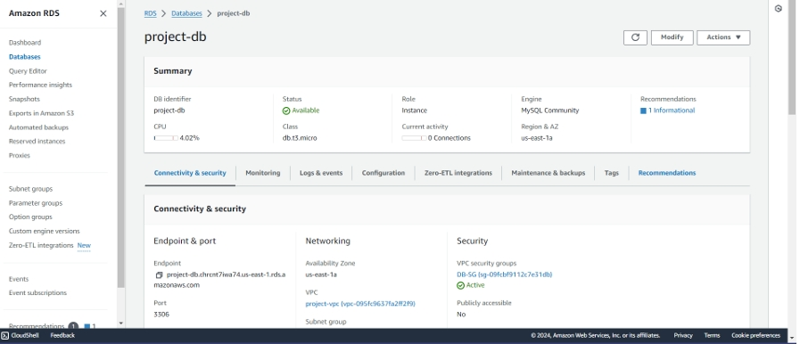

#### Step 3.2: Database Security Group
- **Goal**: Limit database access to authorized applications.
- **Actions**:
  1. Set up a security group to permit MySQL traffic (port 3306) only from the web app.
- **Key Tools**: AWS Security Groups, AWS Management Console.
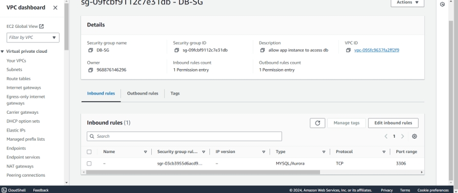
---

### Phase 4: Database Migration
- **Objective**: Migrate the database from EC2 to RDS for better scalability and reliability.
- **Steps**:
  1. Export the database from EC2.
  2. Import the database dump into RDS.
- **Tools Used**: MySQL, AWS RDS, AWS EC2.

---

## Cost Overview

The estimated costs for maintaining this infrastructure over a year:
- **RDS (MySQL)**: $2,416.80/year.
- **Application Load Balancer**: $337.32/year.
- **EC2 Instances**: $137.64/year.
- **Secrets Manager**: $4.80/year.
- **VPC NAT Gateway**: $396.96/year.

Refer to the [AWS Pricing Calculator](https://calculator.aws/#/estimate) for details.
  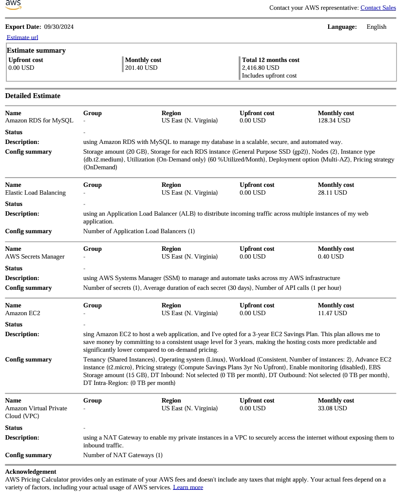

---

## Validation and Testing

The deployment was verified by performing CRUD operations in the web app to ensure proper functionality.
  

---

## Architecture Diagram

  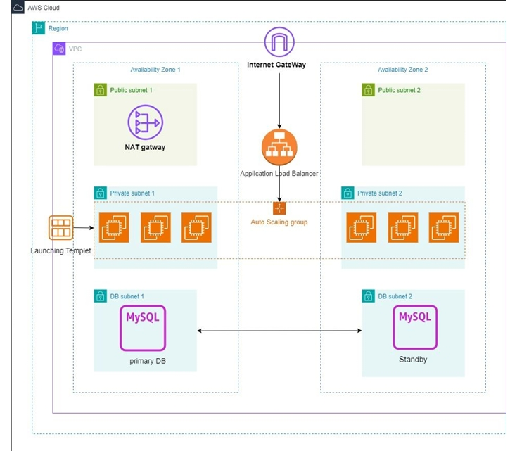

---

## Support

For questions or assistance, visit [AWS Contact Us](https://aws.amazon.com/contact-us/).

---

**Disclaimer**  
This project leverages AWS services and the associated costs are estimates. Actual usage may result in different fees.
